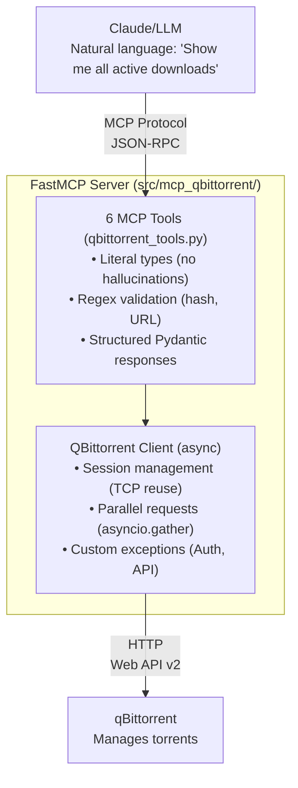

# MCP qBittorrent Server

> Production-grade Model Context Protocol server enabling AI assistants to manage qBittorrent through natural language

## Overview

A FastMCP-based server implementing the **Model Context Protocol (MCP)** for seamless qBittorrent API integration with Large Language Models. Built with modern Python async/await patterns, comprehensive type safety, and 2025 MCP best practices for maximum LLM reasoning accuracy.

**LLM Tool Use Optimization:**
- Structured Pydantic responses enable reliable parsing by language models
- Literal types constrain LLM hallucinations by enforcing valid enum values
- Regex pattern validation prevents invalid inputs before API calls
- Enhanced docstrings with natural language examples guide LLM behavior

**Production-Ready Infrastructure:**
- Async/await architecture for concurrent request handling
- Parallel API calls with `asyncio.gather()` reducing latency by ~50%
- Environment-based configuration following 12-factor app principles
- Comprehensive error handling with structured responses


## Architecture

### System Design



### Component Breakdown

| Component | Responsibility |
|-----------|----------------|
| `server.py` | FastMCP initialization & tool registration |
| `config.py` | Environment-based settings with validation |
| `qbittorrent_client.py` | Async HTTP client with session management |
| `qbittorrent_tools.py` | 6 MCP tools with enhanced annotations |
| `models/schemas.py` | Structured Pydantic response models |

## MCP Tools & Architecture

### Tool Overview

Six production-ready tools enabling natural language torrent management:

| Tool | Function | Input Validation |
|------|----------|------------------|
| `qb_list_torrents` | List torrents with filters | `Literal` types for state enums |
| `qb_torrent_info` | Detailed torrent info | Regex pattern for 40-char hash |
| `qb_add_torrent` | Add torrent by URL/magnet | URL/magnet pattern validation |
| `qb_control_torrent` | Pause/resume/delete | `Literal` types for actions |
| `qb_search_torrents` | Search via plugins | Query length constraints |
| `qb_get_preferences` | Get application settings | Structured response model |

### MCP Best Practices Implementation

This implementation follows **6 core MCP principles** for optimal LLM reasoning:

#### 1. **Type Constraints** - Prevent LLM Hallucinations
```python
action: Annotated[
    Literal["pause", "resume", "delete"],
    Field(description="Action: pause (stop), resume (start), delete (remove)")
]
```
**Why**: `Literal` types constrain LLM to valid enum values, preventing invalid actions like "stop" or "cancel"

#### 2. **Regex Validation** - Catch Invalid Inputs Early
```python
hash: Annotated[
    str,
    Field(
        pattern=r"^[a-fA-F0-9]{40}$",
        min_length=40,
        max_length=40
    )
]
```
**Why**: Validates torrent hash format before making API calls, reducing error round-trips

#### 3. **Structured Responses** - Enable Reliable Parsing
```python
class TorrentActionResponse(BaseModel):
    success: bool
    message: Optional[str]
    error: Optional[str]
```
**Why**: Consistent response structure allows LLM to reliably extract success/failure and details

#### 4. **Natural Language Docstrings** - Guide Tool Selection
```python
"""List all torrents with optional filtering.

Example uses:
- "Show me all my torrents"
- "What's currently downloading?"
- "List completed torrents"
"""
```
**Why**: LLM matches user intent to correct tool using natural language examples

#### 5. **Input Constraints** - Validate Ranges and Lengths
```python
limit: Annotated[
    int,
    Field(ge=1, le=500, description="Maximum number of results")
]
```
**Why**: Prevents resource exhaustion from unbounded queries

#### 6. **Enhanced Descriptions** - Provide Context for Parameters
```python
delete_files: Annotated[
    bool,
    Field(
        False,
        description="Only for 'delete' action: If True, also delete downloaded files from disk"
    )
]
```
**Why**: LLM understands parameter implications and can warn users about destructive operations

## Quick Start

### Prerequisites
- Python 3.11+
- uv package manager ([installation](https://github.com/astral-sh/uv))
- qBittorrent with Web UI enabled

### Installation

```bash
# 1. Clone and setup
git clone <repo-url> && cd mcp-qbittorrent
uv sync

# 2. Configure environment
cp .env.example .env
# Edit .env with your qBittorrent credentials:
#   QB_MCP_QBITTORRENT_URL=http://localhost:15080
#   QB_MCP_QBITTORRENT_USERNAME=admin
#   QB_MCP_QBITTORRENT_PASSWORD=your_password

# 3. Verify installation
uv run python main.py  # Should connect and list torrents
```

### Running

```bash
# Start MCP server
uv run python -m mcp_qbittorrent.server

# Run tests (30/30 passing)
uv run pytest -v

# Run tests with coverage
uv run pytest --cov=src/mcp_qbittorrent --cov-report=term

# Run only unit tests
uv run pytest tests/unit/ -v

# Run only integration tests (requires running qBittorrent)
uv run pytest tests/integration/ -v
```

### Configuration

Environment variables with `QB_MCP_` prefix (managed via Pydantic BaseSettings):

| Variable | Required | Default | Description |
|----------|----------|---------|-------------|
| `QB_MCP_QBITTORRENT_URL` | ✅ | - | qBittorrent Web UI URL |
| `QB_MCP_QBITTORRENT_USERNAME` | ✅ | - | Web UI username |
| `QB_MCP_QBITTORRENT_PASSWORD` | ✅ | - | Web UI password |
| `QB_MCP_REQUEST_TIMEOUT` | ❌ | 30 | HTTP request timeout (seconds) |

**Note**: Server fails fast if required settings are missing (Pydantic validation)


## Project Structure

```
src/mcp_qbittorrent/
├── server.py                 # FastMCP initialization
├── config.py                 # Environment settings
├── clients/
│   └── qbittorrent_client.py # Async API client
├── models/
│   └── schemas.py            # Pydantic response models
└── tools/
    └── qbittorrent_tools.py  # 6 MCP tools

tests/
├── unit/
│   └── test_client.py        # Unit tests with mocks
├── integration/
│   └── test_qbittorrent_integration.py  # Real instance tests
├── test_qbittorrent_client.py
├── test_integration.py
├── fixtures.py               # Test fixtures and mocks
└── conftest.py               # pytest configuration
```

## Usage Examples

Natural language interactions through Claude:

```
User: "Show me all active downloads"
→ list_downloads(filter="downloading")

User: "Pause the Ubuntu torrent"
→ get_download_info(query="Ubuntu")
→ control_download(hash="abc123...", action="pause")

User: "Find Ubuntu 24.04 torrents"
→ search_downloads(query="Ubuntu 24.04", limit=10)

User: "What's my download speed limit?"
→ get_settings()
```

**Structured Response Example:**
```json
{
  "success": true,
  "count": 3,
  "torrents": [
    {
      "hash": "abc123...",
      "name": "ubuntu-24.04-desktop-amd64.iso",
      "state": "downloading",
      "progress": 0.45,
      "dlspeed": 5242880
    }
  ]
}
```

## Development Status

**Completed (Phases 1-3):**
- ✅ Async Python client with session management
- ✅ 6 MCP tools (Literal types, regex validation, structured responses)
- ✅ Comprehensive testing suite
- ✅ Clean architecture: Single responsibility, DRY principles

**Planned (Phases 4-5):**
- ⏳ Containerization: Dockerfile + docker-compose
- ⏳ Integration: Multi-container deployment with existing services
- ⏳ CI/CD: Automated testing pipeline

## Technical Highlights

**MCP Protocol Implementation:**
- **Type Constraints for LLM Accuracy**: `Literal` types prevent hallucinations by constraining valid enum values (filter states, torrent actions)
- **Regex Validation**: Pattern matching for 40-char hex hashes and URLs catches invalid inputs before API calls
- **Structured Responses**: Pydantic models ensure consistent, parseable outputs (success/error/data fields)
- **Enhanced Docstrings**: Natural language examples guide LLM tool selection ("Show me all active downloads" → `list_downloads(filter="downloading")`)

**Why These Design Choices Matter:**
- **Async/Await Throughout**: Non-blocking I/O prevents thread blocking during network requests to qBittorrent API
- **Parallel API Calls**: `asyncio.gather()` in `get_torrent_info()` fetches properties + files concurrently
- **Session Management**: Persistent aiohttp session reuses TCP connections, avoiding costly handshakes per request
- **Environment-Based Config**: 12-factor app principles enable different configurations per deployment (local/container/production)
- **Custom Exception Hierarchy**: `AuthenticationError` vs `APIError` enables precise error handling and meaningful user feedback

**Code Quality:**
- Single Responsibility Principle: Each function averages 15-20 lines
- DRY principles: Unified `_request()` method for all HTTP operations
- Modern Python: f-strings, comprehensions, context managers (`async with`)
- Comprehensive test coverage (unit + integration)

## Security & Best Practices

**Security:**
- Environment-based credentials (never hardcoded) via Pydantic BaseSettings
- Input validation on all MCP tool parameters (min/max length, regex patterns)
- Session-based authentication with cookie management
- Timeout handling prevents resource exhaustion from hanging requests
- Container isolation planned (Phase 4)

## References

- **MCP Protocol**: [spec.modelcontextprotocol.io](https://spec.modelcontextprotocol.io/)
- **FastMCP**: [github.com/jlowin/fastmcp](https://github.com/jlowin/fastmcp)
- **qBittorrent API**: [qBittorrent Wiki](https://github.com/qbittorrent/qBittorrent/wiki/WebUI-API-(qBittorrent-4.1))

## License & Contributing

MIT License - See LICENSE file for details.

Development guidelines and architecture decisions: See [CLAUDE.md](CLAUDE.md)
